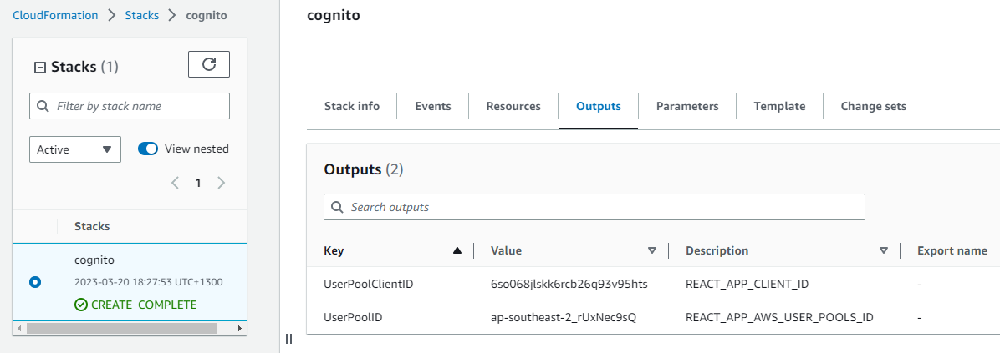

# Week 3 — Decentralized Authentication

## Provision Cognito User Group

Create AWS Cognito User Pool from AWS Console or using the following CloudFormation template: 
https://raw.githubusercontent.com/bayupw/aws-bootcamp-cruddur-2023/main/cruddur-simple-cognito-cfn.yml

## Configure AWS Amplify

Import amplify add add cognito details into the `app.js` under `frontend-react-js/src/`

```js
import { Amplify } from 'aws-amplify';

Amplify.configure({
  "AWS_PROJECT_REGION": process.env.REACT_APP_AWS_PROJECT_REGION,
  "aws_cognito_region": process.env.REACT_APP_AWS_COGNITO_REGION,
  "aws_user_pools_id": process.env.REACT_APP_AWS_USER_POOLS_ID,
  "aws_user_pools_web_client_id": process.env.REACT_APP_CLIENT_ID,
  "oauth": {},
  Auth: {
    region: process.env.REACT_APP_AWS_PROJECT_REGION,
    userPoolId: process.env.REACT_APP_AWS_USER_POOLS_ID,
    userPoolWebClientId: process.env.REACT_APP_CLIENT_ID,
  }
});
```

## Update Home Feed Page

Add the following code into the `HomeFeedPage.js` under `frontend-react-js/src/pages`

```js
import { Auth } from 'aws-amplify';

// replace const `loadData` with the following code
  const loadData = async () => {
    try {
      const backend_url = `${process.env.REACT_APP_BACKEND_URL}/api/activities/home`
      const res = await fetch(backend_url, {
        headers: {
          Authorization: `Bearer ${localStorage.getItem("access_token")}`
        },
        method: "GET"
      });
      let resJson = await res.json();
      if (res.status === 200) {
        setActivities(resJson)
      } else {
        console.log(res)
      }
    } catch (err) {
      console.log(err);
    }
  };

// replace `const checkAuth` with the following code to check whether user is authenticated or not
const checkAuth = async () => {
  Auth.currentAuthenticatedUser({
    // Optional, By default is false. 
    // If set to true, this call will send a 
    // request to Cognito to get the latest user data
    bypassCache: false 
  })
  .then((user) => {
    console.log('user',user);
    return Auth.currentAuthenticatedUser()
  }).then((cognito_user) => {
      setUser({
        display_name: cognito_user.attributes.name,
        handle: cognito_user.attributes.preferred_username
      })
  })
  .catch((err) => console.log(err));
};
```

Add the following code into the `ProfileInfo.js` under `frontend-react-js/src/components`

```js
// comment out or delete `import Cookies from 'js-cookie'` 
// import Cookies from 'js-cookie'
import { Auth } from 'aws-amplify';

// replace line 14-26 `const signOut` with the following code
const signOut = async () => {
  try {
      await Auth.signOut({ global: true });
      window.location.href = "/"
      localStorage.removeItem("access_token")
  } catch (error) {
      console.log('error signing out: ', error);
  }
}
```

## Update Sign In Page

Add the following code into the `SigninPage.js` under `frontend-react-js/src/pages`

```js
// comment out or delete `import Cookies from 'js-cookie'` 
// import Cookies from 'js-cookie'
import { Auth } from 'aws-amplify';

// replace line 15-26 `const onsubmit` with the following code
const onsubmit = async (event) => {
  setErrors('')
  event.preventDefault();
  Auth.signIn(email, password)
  .then(user => {
    console.log('user',user)
    localStorage.setItem("access_token", user.signInUserSession.accessToken.jwtToken)
    window.location.href = "/"
  })
  .catch(error => { 
    if (error.code == 'UserNotConfirmedException') {
      window.location.href = "/confirm"
    }
    setErrors(error.message)
  });
  return false
}
```

Add the following Env Var to `frontend-react-js:` under section `environment:` in `docker-compose.yml` file

```yml
      REACT_APP_AWS_PROJECT_REGION: "${AWS_DEFAULT_REGION}"
      REACT_APP_AWS_COGNITO_REGION: "${AWS_DEFAULT_REGION}"
      REACT_APP_AWS_USER_POOLS_ID: "${REACT_APP_AWS_USER_POOLS_ID}"
      REACT_APP_CLIENT_ID: "${REACT_APP_CLIENT_ID}"
```

## Update Signup Page

Add the following code into the `SignupPage.js` under `frontend-react-js/src/pages`

```js
// comment out or delete `import Cookies from 'js-cookie'` 
// import Cookies from 'js-cookie'
import { Auth } from 'aws-amplify';

// replace line 17-30 `const onsubmit` with the following code
const onsubmit = async (event) => {
  event.preventDefault();
  setErrors('')
  try {
      const { user } = await Auth.signUp({
        username: email,
        password: password,
        attributes: {
            name: name,
            email: email,
            preferred_username: username,
        },
        autoSignIn: { // optional - enables auto sign in after user is confirmed
            enabled: true,
        }
      });
      console.log(user);
      window.location.href = `/confirm?email=${email}`
  } catch (error) {
      console.log(error);
      setErrors(error.message)
  }
  return false
}

let errors;
if (cognitoErrors){
  errors = <div className='errors'>{cognitoErrors}</div>;
}

//before submit component
{errors}
```

## Update Confirmation Page

Add the following code into the `SignupPage.js` under `frontend-react-js/src/pages`

```js
// comment out or delete `import Cookies from 'js-cookie'` 
// import Cookies from 'js-cookie'
import { Auth } from 'aws-amplify';

// replace `const resend_code` with the following code
const resend_code = async (event) => {
  setErrors('')
  try {
    await Auth.resendSignUp(email);
    console.log('code resent successfully');
    setCodeSent(true)
  } catch (err) {
    // does not return a code
    // does cognito always return english
    // for this to be an okay match?
    console.log(err)
    if (err.message == 'Username cannot be empty'){
      setErrors("You need to provide an email in order to send Resend Activiation Code")   
    } else if (err.message == "Username/client id combination not found."){
      setErrors("Email is invalid or cannot be found.")   
    }
  }
}

// replace `const onsubmit` with the following code
  const onsubmit = async (event) => {
    event.preventDefault();
    setErrors('')
    try {
      await Auth.confirmSignUp(email, code);
      window.location.href = "/"
    } catch (error) {
      setErrors(error.message)
    }
    return false
  }
```

## Update Recovery Page

Add the following code into the `RecoverPage.js` under `frontend-react-js/src/pages`

```js
// comment out or delete `import Cookies from 'js-cookie'` 
// import Cookies from 'js-cookie'
import { Auth } from 'aws-amplify';

const onsubmit_send_code = async (event) => {
  event.preventDefault();
  setErrors('')
  Auth.forgotPassword(username)
  .then((data) => setFormState('confirm_code') )
  .catch((err) => setErrors(err.message) );
  return false
}

const onsubmit_confirm_code = async (event) => {
  event.preventDefault();
  setErrors('')
  if (password == passwordAgain){
    Auth.forgotPasswordSubmit(username, code, password)
    .then((data) => setFormState('success'))
    .catch((err) => setErrors(err.message) );
  } else {
    setErrors('Passwords do not match')
  }
  return false
}


## JWT 

Go to ```backend-flask``` directory and add the following line to the `requirements.txt` file

```
Flask-AWSCognito
```

Add the following Env Vars to `backend-flask:` under section `environment:` in `docker-compose.yml` file

```yml
      AWS_COGNITO_USER_POOL_ID: "${COGNITO_USER_POOLS_ID}"
      AWS_COGNITO_USER_POOL_CLIENT_ID: "${COGNITO_CLIENT_ID}"  
```

Create a new directory under `backend-flask:` and create a new file `cognito_jwt_token.py` and add the following code

```py
import time
import requests
from jose import jwk, jwt
from jose.exceptions import JOSEError
from jose.utils import base64url_decode

class FlaskAWSCognitoError(Exception):
  pass

class TokenVerifyError(Exception):
  pass

def extract_access_token(request_headers):
    access_token = None
    auth_header = request_headers.get("Authorization")
    if auth_header and " " in auth_header:
        _, access_token = auth_header.split()
    return access_token

class CognitoJwtToken:
    def __init__(self, user_pool_id, user_pool_client_id, region, request_client=None):
        self.region = region
        if not self.region:
            raise FlaskAWSCognitoError("No AWS region provided")
        self.user_pool_id = user_pool_id
        self.user_pool_client_id = user_pool_client_id
        self.claims = None
        if not request_client:
            self.request_client = requests.get
        else:
            self.request_client = request_client
        self._load_jwk_keys()


    def _load_jwk_keys(self):
        keys_url = f"https://cognito-idp.{self.region}.amazonaws.com/{self.user_pool_id}/.well-known/jwks.json"
        try:
            response = self.request_client(keys_url)
            self.jwk_keys = response.json()["keys"]
        except requests.exceptions.RequestException as e:
            raise FlaskAWSCognitoError(str(e)) from e

    @staticmethod
    def _extract_headers(token):
        try:
            headers = jwt.get_unverified_headers(token)
            return headers
        except JOSEError as e:
            raise TokenVerifyError(str(e)) from e

    def _find_pkey(self, headers):
        kid = headers["kid"]
        # search for the kid in the downloaded public keys
        key_index = -1
        for i in range(len(self.jwk_keys)):
            if kid == self.jwk_keys[i]["kid"]:
                key_index = i
                break
        if key_index == -1:
            raise TokenVerifyError("Public key not found in jwks.json")
        return self.jwk_keys[key_index]

    @staticmethod
    def _verify_signature(token, pkey_data):
        try:
            # construct the public key
            public_key = jwk.construct(pkey_data)
        except JOSEError as e:
            raise TokenVerifyError(str(e)) from e
        # get the last two sections of the token,
        # message and signature (encoded in base64)
        message, encoded_signature = str(token).rsplit(".", 1)
        # decode the signature
        decoded_signature = base64url_decode(encoded_signature.encode("utf-8"))
        # verify the signature
        if not public_key.verify(message.encode("utf8"), decoded_signature):
            raise TokenVerifyError("Signature verification failed")

    @staticmethod
    def _extract_claims(token):
        try:
            claims = jwt.get_unverified_claims(token)
            return claims
        except JOSEError as e:
            raise TokenVerifyError(str(e)) from e

    @staticmethod
    def _check_expiration(claims, current_time):
        if not current_time:
            current_time = time.time()
        if current_time > claims["exp"]:
            raise TokenVerifyError("Token is expired")  # probably another exception

    def _check_audience(self, claims):
        # and the Audience  (use claims['client_id'] if verifying an access token)
        audience = claims["aud"] if "aud" in claims else claims["client_id"]
        if audience != self.user_pool_client_id:
            raise TokenVerifyError("Token was not issued for this audience")

    def verify(self, token, current_time=None):
        """ https://github.com/awslabs/aws-support-tools/blob/master/Cognito/decode-verify-jwt/decode-verify-jwt.py """
        if not token:
            raise TokenVerifyError("No token provided")

        headers = self._extract_headers(token)
        pkey_data = self._find_pkey(headers)
        self._verify_signature(token, pkey_data)

        claims = self._extract_claims(token)
        self._check_expiration(claims, current_time)
        self._check_audience(claims)

        self.claims = claims 
        return claims
```

Add the following code to the `app.py`

```py
from flask_cors import CORS, cross_origin

from lib.cognito_jwt_token import CognitoJwtToken, extract_access_token, TokenVerifyError

app = Flask(__name__)

cognito_jwt_token = CognitoJwtToken(
  user_pool_id=os.getenv("AWS_COGNITO_USER_POOL_ID"), 
  user_pool_client_id=os.getenv("AWS_COGNITO_USER_POOL_CLIENT_ID"),
  region=os.getenv("AWS_DEFAULT_REGION")
)

def data_home():
  access_token = extract_access_token(request.headers)
  try:
    claims = cognito_jwt_token.verify(access_token)
    # authenicatied request
    app.logger.debug("authenicated")
    app.logger.debug(claims)
    app.logger.debug(claims['username'])
    data = HomeActivities.run(cognito_user_id=claims['username'])
  except TokenVerifyError as e:
    # unauthenicatied request
    app.logger.debug(e)
    app.logger.debug("unauthenicated")
    data = HomeActivities.run()
  return data, 200
```

Update `home_activities.py` file under `backend-flask/services`

Update `def run():` with the following code

```py
def run(cognito_user_id=None):
```

Add with the following code at the bottom

```py
      if cognito_user_id != None:
        extra_crud = {
          'uuid': '248959df-3079-4947-b847-9e0892d1bab4',
          'handle':  'Lore',
          'message': 'My dear brother, it the humans that are the problem',
          'created_at': (now - timedelta(hours=1)).isoformat(),
          'expires_at': (now + timedelta(hours=12)).isoformat(),
          'likes': 1042,
          'replies': []
        }
        results.insert(0,extra_crud)

      span.set_attribute("app.result_length", len(results))
      return results
```

## Test the updated code 

Cognito User Pool ID and Client ID can also be retrieved from the CloudFormation stack output


Install dependencies from the ```backend-flask``` directory, install npm, aws-amplify, set env vars and run docker compose up

```sh
cd backend-flask
pip install -r requirements.txt
cd ..
cd frontend-react-js
npm install aws-amplify --save
npm install

export AWS_ACCESS_KEY_ID="keyid"
export AWS_SECRET_ACCESS_KEY="secretkey"
export AWS_DEFAULT_REGION="ap-southeast-2"
export COGNITO_USER_POOLS_ID="UserPoolClientID"
export COGNITO_CLIENT_ID="AWS Cognito Client ID"

gp env AWS_ACCESS_KEY_ID="keyid"
gp env AWS_SECRET_ACCESS_KEY="secretkey"
gp env AWS_DEFAULT_REGION="ap-southeast-2"
gp env COGNITO_USER_POOLS_ID="UserPoolClientID"
gp env COGNITO_CLIENT_ID="UserPoolID"

cd ..
docker compose -f "docker-compose.yml" up -d --build
```
